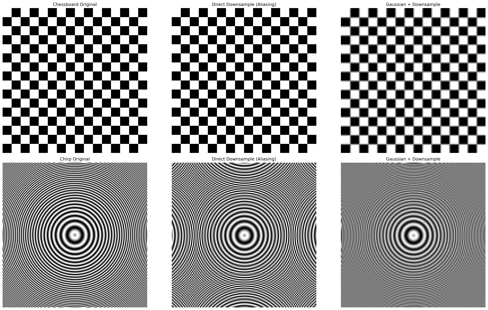
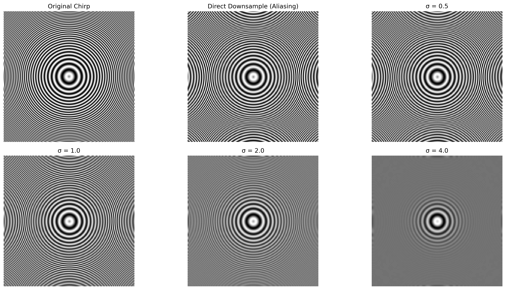
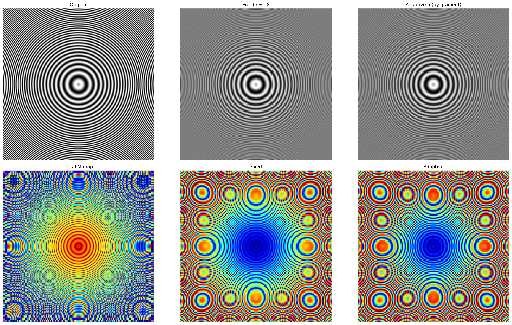

# 实验 4：图像下采样、抗混叠滤波与自适应下采样

## 基础信息
### 课程：计算机视觉实验
### 姓名：黄敏敏
### 学号：2023101151


## 项目概述
本实验围绕图像下采样的抗混叠原理展开，完成三大核心任务：
1. 验证下采样混叠现象与高斯抗混叠滤波的有效性
2. 验证 σ≈0.45M 经验公式的最优性
3. 实现基于梯度的自适应下采样并对比传统方案同时完成空域梯度法与 FFT 能量法的局部频率估计一致性验证，构建从基础原理验证到算法优化的完整实验流程。

## 实验环境

编程语言：Python 3.x

核心依赖库：opencv-python、numpy、matplotlib

安装命令：
bash运行pip install opencv-python numpy matplotlib

## 文件说明
```

├── lab04.py                       # 实验源代码
├── 计算机视觉实验报告四.docx        #实验报告          
├── experiment4_output/           # 实验结果输出目录
│   ├── full_comparison.png       # 基础混叠与时域对比图
│   ├── fft_spectrum_comparison.png # 频域混叠验证图
│   ├── sigma_validation_chirp.png # σ参数时域对比图
│   ├── sigma_fft_chirp.png       # σ参数频域对比图
│   └──  adaptive_downsample.png   # 自适应下采样对比与误差图
└── readme.md                     # 项目说明文档
```

## 实验原理
1. 下采样与混叠
根据奈奎斯特 - 香农采样定理，直接下采样会因采样率不足导致高频分量折叠，产生莫尔纹、锯齿等混叠伪影，因此下采样前必须进行抗混叠低通滤波。
2. 高斯抗混叠滤波
高斯滤波作为线性低通滤波器，通过参数 σ 控制滤波强度：
σ 过小：滤波不足，混叠残留
σ 过大：滤波过强，细节丢失工程最优经验公式：σ≈0.45M（M 为下采样倍数）
3. FFT 频域验证
通过二维快速傅里叶变换将图像转换至频域，直观验证混叠的产生（虚假频点）与消除（频谱干净）。
4. 基于梯度的自适应下采样
利用 Sobel 算子计算图像局部梯度，梯度幅值与局部频率正相关：
高梯度（细节区）：分配小 M、小 σ，弱滤波保细节
低梯度（平坦区）：分配大 M、大 σ，强滤波抗混叠实现滤波强度的空间自适应调整，解决全局参数的适配性缺陷。

## 实验结果示例
1. 基础混叠验证

直接下采样出现明显莫尔纹、锯齿，频谱存在大量虚假频点
高斯滤波后下采样无混叠伪影，频谱干净集中，验证了抗混叠滤波的必要性

2. σ 参数验证

σ=0.5/1.0：混叠残留严重；σ=4.0：过度模糊、细节丢失
σ=2.0 与理论值 σ=1.8 高度吻合，实现抗混叠与细节保留的最佳平衡，验证了 σ≈0.45M 公式的正确性

3. 自适应下采样验证

自适应方案在边缘细节区保留更清晰的结构，中心区无混叠，视觉效果优于固定 σ 方案
自适应方法的整体误差更小、分布更均匀，边缘高误差区显著减少，重建精度显著提升

## 实验结论

1. 下采样前必须进行抗混叠滤波，高斯滤波可有效消除混叠伪影
2. σ≈0.45M 经验公式可在抗混叠与细节保留间实现最优平衡
3. 基于梯度的自适应下采样可动态调整滤波强度，显著优于全局统一下采样方案


## 运行说明

安装依赖库：pip install opencv-python numpy matplotlib

运行主代码：python practise4.py

所有实验结果自动保存至 experiment4_output 目录

代码支持无 GUI 运行，自动保存图像，无需手动操作


