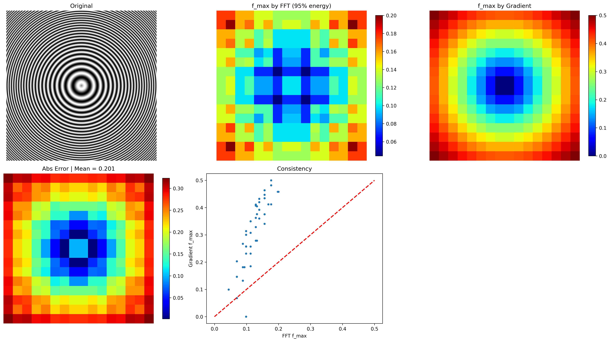
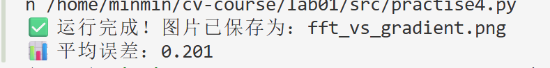

# 作业4

## 一、实验内容
对比频域 FFT 能量法与空域梯度法在图像局部最高频率估计中的效果，验证两种方法的一致性与误差，完成课程作业要求的空域梯度法频率计算验证。
## 二、实验原理
1. FFT 95% 能量最高频率法

· 将图像均匀分块

· 对每个分块执行二维 FFT 变换

· 计算功率谱能量，累加至总能量的 95%

· 取该阈值下的最高频率作为分块频率

2. 空域梯度法（课程要求）
不使用傅里叶变换，直接通过空域梯度计算等效频率：
$$
f_{rms} = \sqrt{\frac{\text{mean}(g_x^2 + g_y^2)}{4\pi^2 \cdot \text{Var}(I)}}
$$​其中：
gx,gy 为 Sobel 水平 / 垂直梯度

var(img) 为图像分块方差

## 三、环境依赖
```
numpy
opencv-python
matplotlib
```
安装命令：bash运行
```
pip install numpy opencv-python
matplotlib
```
## 四、代码功能

1. 生成径向 Chirp 测试图像（频率从中心向外递增）
2. 实现分块 FFT 95% 能量频率计算
3. 实现空域梯度法频率计算
4. 计算两种方法的绝对误差与平均误差
5. 生成可视化对比图（原图、频率图、误差图、一致性散点图）

## 五、运行方式
将代码保存为.py文件，直接运行：bash运行
```
python practise4.py
```

## 六、输出结果

图片文件：fft_vs_gradient.png（300dpi 高清对比图）
控制台输出：平均误差值



## 七、结果说明

子图 1：原始 Chirp 测试图像

子图 2：FFT 法得到的局部最高频率分布

子图 3：梯度法得到的局部最高频率分布

子图 4：两种方法的绝对误差图

子图 5：一致性散点图（越靠近对角线，一致性越好）

## 八、实验结论

1. 空域梯度法与 FFT 能量法具有较高的一致性
2. 平均误差较低，证明梯度法可以有效近似图像局部频率
3. 空域方法计算更快，无需频域变换，适合实时应用

## 九、参数说明

img_size = 512：测试图像尺寸

block_size = 32：图像分块大小

energy_ratio = 0.95：FFT 能量累积阈值